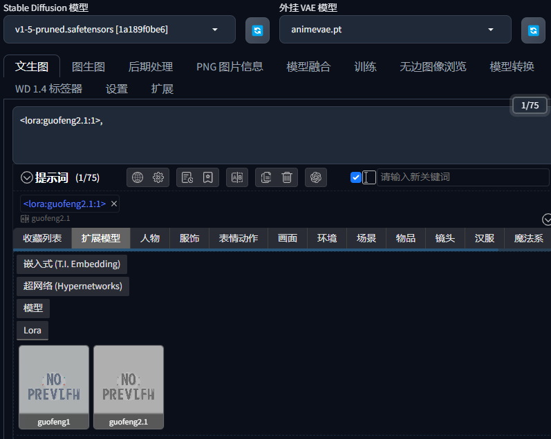
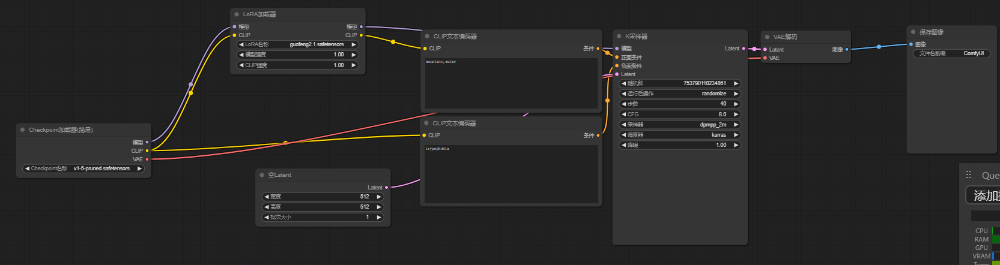
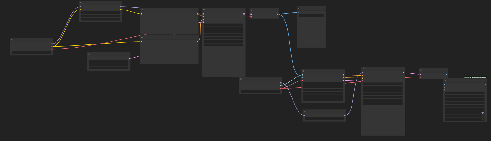

# GuofengLoRA使用文档

本项目是一个中文项目，由于作者编写相关文档经验不足，如有格式上的指导或建议欢迎在 [Issues](https://github.com/KBRASK/GuofengLoRA/issues) 中指出。

## 目录
1. [简介](#简介)
3. [GuofengLoRA使用方法](#GuofengLoRA使用方法)
4. [搭配SVD的使用方法](#搭配SVD的使用方法)
5. [搭配Anytext的使用方法](#搭配Anytext的使用方法)
6. [LoRA模型训练方法](#LoRA模型训练方法)
7. [技术原理](#技术原理)
8. [开源工具致谢](#开源工具致谢)

# 简介
GuofengLoRA是一个基于SD1.5的拥有生成特定中国山水画画风的LoRA模型
其融合SVD模型后可以得到文生视频的能力
其融合Anytext模型后可以得到生成带有指定汉字的国风山水画

本项目提供其模型的两个版本及对应的两份带tag的训练集
说明利用的训练工具和推理使用的工具 并简述其训练思路及方法
并提供其与SVD模型或Anytext共同使用的方法。
# GuofengLoRA使用方法
## 简单文生图
利用简单的文字提示词生成对应的山水画
_本功能windows和linux可用_

### _实现该功能必备的工具有_
1.SD1.5基础模型
在下载lora模型前，确保你已经下载了[SD1.5的基础模型](https://huggingface.co/runwayml/stable-diffusion-v1-5/tree/main) 若只用于推理生图,下载emaonly版本即可,若用于训练LoRA模型,建议下载未修剪版本的(7.7GB)

2.推理工具
推理工具建议使用B站up主[秋葉aaaki](https://space.bilibili.com/12566101)的[WebUI整合包](https://www.bilibili.com/video/BV1iM4y1y7oA/) 或者[ComfyUI](https://www.bilibili.com/video/BV1Ew411776J/)
前者适合新手使用,如果想使用GuofengLoRAwithSVD的文生视频功能,请使用ComfyUI
根据秋葉aaak的安装教程安装即可

3.GuofengLoRA模型
在本仓库的LoRA文件夹内获取,其中2.1版本生图稳定性更好,两者风格较有不同。

基础模型放在对应推理工具文件夹下的\\models\\Stable-diffusion内
GuofengLoRA模型放在\\models\\Lora文件夹下

### 1.WebUI下使用方法

进入推理工具后,左上角的Stable Diffusion模型选择刚刚放入的基础模型

接下来在正向提示词部分选择扩展模型中一个版本的GuofengLoRA模型
在","后面写上生图像的正向提示词

推荐使用的正向提示词为: water,mountain
推荐使用的负面提示词为: trypophobia,
下面的steps建议设置为36-45
Sampler选择DPM++ 2M Karras
宽度和高度都选择512像素

### ComfyUI下使用方法

接下来下载本仓库中template中的texttoimageworkflow.json 导入即可

效果如下

# 搭配SVD的使用方法

先下载svd模型,下载[svd_xt.safetensors](https://huggingface.co/stabilityai/stable-video-diffusion-img2vid-xt/tree/main)

放在对应推理工具文件夹下的\\models\\Stable-diffusion内

下载仓库中的template中的lorawithsvdworkflow.json导入ComfyUI即可

效果如下

# 搭配Anytext的使用方法

_此功能在linux系统下使用_

[Anytext](https://github.com/tyxsspa/AnyText)是阿里达摩院构建并开源的多语言视觉文本生成和编辑模型

其拥有在指定位置生成指定文字的强大能力,而搭配上本项目的LoRA模型即可生成高质量的带有书法文字的国风山水画。
### 方法一：
首先部署[Anytext](https://github.com/tyxsspa/AnyText)（按照阿里达摩院的Anytext项目文档部署）,需要使用linux系统,推荐使用docker配置。

然后下载本项目仓库的一个任意版本的Guofeng LoRA模型,可以存放在anytext文件内任意路径

之后下载本项目仓库的Replace_file\\demo.py(修改了内置参数，增加了一个示例)并替换anytext文件内的demo.py

下载本项目仓库中的Replace_file\\gengen.png,并移动至 AnyText\\example_images内

接下来按照anytext的项目文档指引,按照其中标明的配置要求更改对应参数

并执行
```bash
  export CUDA_VISIBLE_DEVICES=0 && python demo.py
```

在对应webui界面中修改lora地址为你刚刚存放的位置的与demo.py的相对地址即可

后面的LoRA权重不建议更改,如出现丢失山水画风格的情况,请略微增大其权重。

至此,AnyTextWithGuoFengLoRA部署完毕


### 方法二：

_本方法暂时失效,由于30GB的文件不方便进行传输_

首先你要安装docker


在命令行内输入
```bash
docker load -i anytextwithlora.tar

docker run --gpus all -p 7860:7860 -w /app/anytext lorawithanytext ./run.sh

```
再次打开的时候只需要执行以下操作

```bash
docker exec -it dockerid(这里换成你的容器id) bash

cd /app/anytext

./run.sh
```

_容器内置了Guofeng LoRA，无需下载除docker本身外任何前置内容_

启动好后在本地浏览器输入[127.0.0.1:7860](127.0.0.1:7860) 即可使用

参数均已内置，可以一键生成


# LoRA模型训练方法
正在编写......

# 技术原理
正在编写......
# 开源工具致谢
正在编写......
